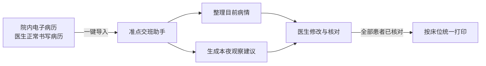

<div align="center">

# 准点交班

**让病历只写一次：AI 整理交班，医生负责核对。**

[](https://nextjs.org/)
[](https://www.typescriptlang.org/)


一个面向住院病区的 AI 交班辅助工具。它读取医生已经完成的电子病历，生成可追溯、可修改、必须人工确认的全病区交班草稿。

</div>

> 本项目使用“口腔颌面头颈肿瘤科”作为演示案例，并非只适用于该科室。仓库内所有患者、病历和诊疗资料均为虚构数据，不用于临床决策。

## 为什么做这个产品

住院医生已经在电子病历中书写了入院记录、病程记录、术前记录和手术记录，但在下班前仍要重新翻阅病历，将患者信息、目前病情和夜班观察重点手工整理成交班记录。

患者数量多、病程时间长时，这一步既重复又容易遗漏最新变化。

“准点交班”不替代电子病历，也不帮助医生编写病史。它作为独立的院内侧边应用，把原来的流程：

```text
书写病历 → 再次翻阅 → 手工摘抄 → 整理交班 → 打印
```

缩短为：

```text
书写病历 → 一键导入 → AI 整理 → 医生核对 → 统一打印
```

## 产品流程



当前 MVP 提供两个职责清晰的入口：

- `/`：模拟医院现有电子病历，负责患者管理和病历书写。
- `/handoff`：独立交班助手，负责导入、整理、核对和打印。

## 核心设计

### 1. 病历一键导入，不再复制粘贴

医生完成病历后，可一次导入全病区患者。系统按照固定模板生成姓名、性别、年龄、床号、诊断、目前病情和需要注意的病情。

### 2. 区分“原文摘录”与“AI 建议”

- **目前病情**：结合入院记录、最新日期病程和必要的术前或术后记录进行摘录与排序，尽量保留医生原有写法和表达意图。
- **需要注意的病情**：病史中通常不会直接写夜班交班备注，因此由 AI 根据当前病情生成仅针对今晚的观察建议，并明确标注“待医生确认”。

两类内容均可查看原文依据。原始资料没有覆盖的信息保持空白，不使用占位语句补齐。

### 3. 医生始终拥有最终确认权

- 所有字段均可修改，并可添加自定义补充内容。
- AI 建议不得自动提交，必须由医生逐位核对。
- 未完成全部患者核对时，系统会阻止统一打印。
- 已核对患者可以撤销核对，且保留医生修改。

### 4. 病历更新不会覆盖已有交班

首次导入后，交班草稿形成独立快照。医生返回电子病历继续修改时，系统不会重新覆盖整轮交班。

医生可以只刷新发生变化的患者；系统仅更新受影响的内容，并保护医生已经手动修改的字段。也可以撤销整轮导入，回到“尚未导入”状态，而不影响电子病历。

### 5. 全病区连续打印

全部患者核对后，系统按照床位顺序将患者整理为连续交班段落，适配仍需纸质交班记录的病区，而不是让每位患者占用一张 A4 纸。

## 演示患者

MVP 保留三位处于不同病程阶段的虚构患者，方便在三分钟内完整展示产品：

| 床位 | 患者 | 诊断 | 当前阶段 |
| --- | --- | --- | --- |
| 03床 | 许女士 | 左下颌骨成釉细胞瘤待查 | 今日新入院 |
| 07床 | 梁先生 | 右舌缘鳞状细胞癌 cT2N0M0 | 明日手术 |
| 12床 | 周女士 | 左腮腺多形性腺瘤 | 手术当日 |

病历时间线支持持续追加文书，并不限制为固定篇数；尚未书写的文书会保留科室模板框架。

## 三分钟演示路径

1. 在电子病历首页展示三位不同阶段的患者。
2. 进入患者病历，展示动态病历时间线和待填写文书框架。
3. 返回列表，点击“一键导入交班”。
4. 打开一位患者，说明“目前病情”与“AI 夜班观察建议”的区别。
5. 查看原文依据、修改内容并确认患者交班。
6. 展示未全部核对时的打印拦截，以及全部核对后的连续打印。
7. 演示“撤销核对”或“撤销本次导入”，说明电子病历不会受到影响。

## 本地运行

环境要求：Node.js 20+。

```bash
npm install
cp .env.example .env.local
npm run dev -- --port 3210
```

打开：

- 电子病历演示：[http://localhost:3210](http://localhost:3210)
- 准点交班助手：[http://localhost:3210/handoff](http://localhost:3210/handoff)

### DeepSeek 配置

DeepSeek 是可选项。没有配置密钥时，项目会使用明确标注的虚构演示结果，便于本地体验完整流程。

```bash
DEEPSEEK_API_KEY=your_api_key
DEEPSEEK_BASE_URL=https://api.deepseek.com
DEEPSEEK_MODEL=deepseek-v4-flash
DEEPSEEK_TIMEOUT_MS=35000
```

密钥仅在服务端读取。真实医疗数据不得在未经医院安全、隐私和合规评估的情况下发送至公网模型。

## 技术实现

- Next.js 16 + React 19 + TypeScript
- CSS Modules 构建蓝白院内系统界面及打印样式
- Zod 约束 AI 结构化输出和接口数据
- DeepSeek 负责病历结构化整理与夜班观察建议
- LocalStorage 保存演示环境中的病历、交班草稿和核对状态
- Vitest、TypeScript、ESLint 提供基础质量检查

## 质量检查

```bash
npm run test
npm run typecheck
npm run lint
npm run build
```

当前自动化测试：**3 个测试文件，18 项测试通过**。

## 医疗安全边界

- AI 只提供辅助摘录和观察建议，不生成诊断结论。
- 交班内容必须由医生人工检查并确认。
- 缺失信息保持空白，不擅自补全事实。
- 当前 MVP 使用虚构数据，不可直接用于真实临床环境。
- 接入真实医院系统前，仍需完成院内接口、权限、审计、数据安全及模型合规评估。

## 仓库说明

PRD、架构设计、技术栈手册和本地环境变量仅供本地参考，已加入 `.gitignore`，不会上传至 GitHub。
